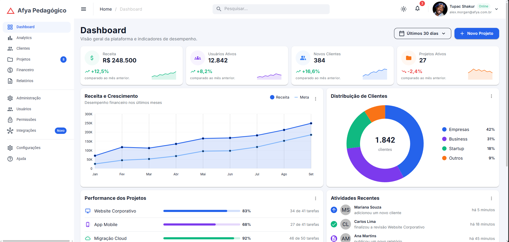
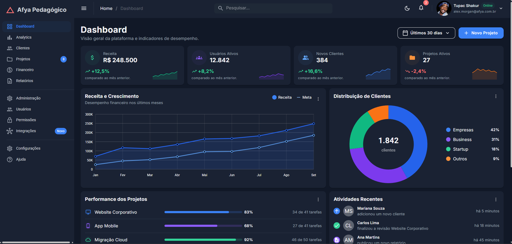
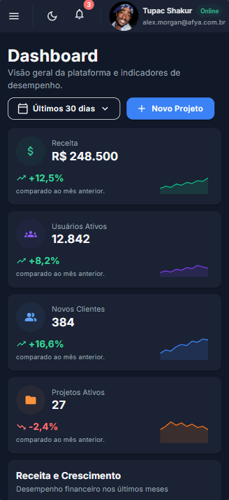
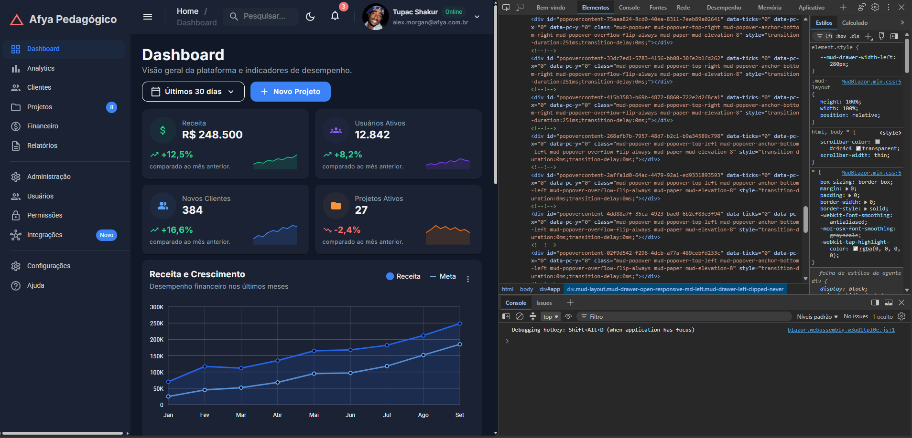

# Afya Admin — Dashboard com Blazor WebAssembly e MudBlazor

## Identificação

| | |
|---|---|
| **Aluno(a)** | Erik Gabriel Dantas Leite |
| **Matrícula** | --------------------------------- |
| **Faculdade** | Afya São Lucas |
| **Curso** | Ciência da Computação |
| **Disciplina** | Desenvolvimento Web|
| **Professor(a)** | Liluyoud Cury de Lacerda |
| **Semestre** | 2026.2 |

## Objetivo do projeto

O Afya Admin é um painel administrativo para a plataforma fictícia **Afya Pedagógico**. A página reúne informações de receita, usuários, clientes e projetos para apresentar uma visão geral da plataforma em uma única tela. Os dados são fictícios e a aplicação executa no navegador com Blazor WebAssembly, sem um backend.

O dashboard apresenta quatro indicadores com pequenos gráficos de tendência, um gráfico de receita comparada à meta e uma rosca com a distribuição de clientes. Também mostra a performance dos projetos com barras de progresso, um feed de atividades recentes e uma tabela com responsáveis, status, progresso e prazos. A navegação lateral e a barra superior completam o layout com busca, notificações, menu do usuário e alternância entre tema claro e escuro.

O projeto integra HTML, C#, componentes reutilizáveis e organização de uma aplicação web. A apresentação usa parâmetros do MudBlazor, um tema centralizado e classes utilitárias nativas, sem CSS próprio para o dashboard. A separação entre dados, componentes e página permite compreender o papel de cada parte e adaptar a interface a celular, tablet e desktop.

### Comportamento da versão atual

- O botão de menu controla a abertura da sidebar e o botão de tema alterna entre claro e escuro.
- O seletor de período altera o texto da opção selecionada; os dados permanecem os mesmos, conforme o tutorial base.
- Busca, criação de projeto e ações de exportação, edição e exclusão são demonstrativas.
- As páginas dos demais links do menu ainda não foram implementadas e usam a página de erro 404.

## Tecnologias utilizadas

- **.NET 10** — framework de destino `net10.0`.
- **Blazor WebAssembly standalone** — execução do código C# no navegador.
- **MudBlazor 9** — componentes visuais, gráficos, tema e utilitários de layout.
- **C# e Razor** — modelos, parâmetros, eventos e composição da interface.
- **HTML e SVG** — estrutura da página hospedeira e texto central do gráfico de rosca.
- **Google Fonts: Inter e Roboto** — fontes carregadas pelo `index.html` e aplicadas pelo tema.
- **Git e GitHub** — versionamento e publicação do código.

## Como executar

### Pré-requisitos

- Instalar o **.NET SDK 10.x**. Confira com `dotnet --version`.
- Ter o Git instalado e acesso ao repositório para cloná-lo.
- Usar um navegador atualizado; Chrome ou Edge permitem a depuração descrita no tutorial.
- Ter conexão à internet para restaurar os pacotes NuGet e carregar as fontes externas.

### Clonar e iniciar

```bash
git clone https://github.com/erikgdl/afya-admin-blazor.git
cd afya-admin-blazor
dotnet build
dotnet watch
```

O primeiro build restaura os pacotes necessários. Não é preciso instalar o template MudBlazor para executar este projeto já criado.

Use a URL informada no terminal. Para selecionar explicitamente o perfil HTTP configurado no projeto:

```bash
dotnet watch run --launch-profile http
```

Nesse perfil, a aplicação fica em **http://localhost:5119**. Os perfis estão em `Properties/launchSettings.json`.

O `dotnet watch` acompanha as alterações dos arquivos e aplica Hot Reload quando possível. Alterações estruturais ou em inicializadores como `_theme` podem exigir reinício: use **Ctrl + R** no terminal do watch. Para encerrar, use **Ctrl + C**.

> O comando de clone usa o endereço remoto atual. Se o repositório for renomeado para `afya-admin`, atualize essa URL antes da entrega.

## Telas

> **Capturas pendentes:** salve os quatro prints reais nos caminhos abaixo. As imagens só aparecerão depois que os arquivos forem adicionados ao repositório.

### Tema claro



A captura deve mostrar o dashboard com sidebar, AppBar, indicadores, gráficos, performance, atividades e tabela no tema claro.

### Tema escuro



A captura deve mostrar a alternância de tema, incluindo o contraste dos textos, as superfícies dos cards e o total central da rosca.

### Versão mobile



A captura deve mostrar os KPIs em uma coluna e a tabela em formato de cards. A busca e a identificação textual do usuário ficam ocultas em telas pequenas.

### HTML gerado (DevTools)



**Inspeção a realizar:** com a aplicação aberta, pressione **F12**, acesse a aba **Elements** e inspecione um card de KPI e o botão **Novo Projeto**. O objetivo é relacionar a marcação Razor com os elementos e classes gerados no navegador.

| Componente a inspecionar | HTML e classes a conferir |
|---|---|
| `MudPaper` do `KpiCard` | Um `div` com classes como `mud-paper`, `mud-elevation-1` e `pa-4`. |
| `MudStack` dentro do KPI | Um `div` de layout flex, com classes como `d-flex` e `flex-row` para o stack horizontal. |
| `MudButton` de Novo Projeto | Um `button` com classes como `mud-button-root` e `mud-button-filled`, além dos elementos internos de texto e ícone. |

No código do KPI, `Class="pa-4"` é repassado ao elemento HTML gerado e aplica 16 pixels de padding usando o CSS nativo do MudBlazor. Essas são referências para conferir na inspeção; após capturar o print, registre aqui os elementos e classes efetivamente observados.

## Estrutura do projeto

```text
afya-admin/
├── Components/
│   ├── AtividadesRecentes.razor
│   ├── CabecalhoPagina.razor
│   ├── DashboardCard.razor
│   ├── GraficoDistribuicaoClientes.razor
│   ├── GraficoReceita.razor
│   ├── KpiCard.razor
│   ├── PerformanceProjetos.razor
│   ├── ProjetosRecentes.razor
│   ├── SeletorPeriodo.razor
│   └── Ui.cs
├── Data/
│   └── DashboardData.cs
├── Layout/
│   ├── MainLayout.razor
│   └── NavMenu.razor
├── Pages/
│   ├── Dashboard.razor
│   └── NotFound.razor
├── Properties/
│   └── launchSettings.json
├── docs/
│   └── prints/
├── wwwroot/
│   ├── css/app.css
│   ├── img/alex-morgan.jpg
│   ├── favicon.png
│   ├── icon-192.png
│   └── index.html
├── .gitignore
├── _Imports.razor
├── afya-admin.csproj
├── App.razor
├── Program.cs
├── README.md
└── tutorial.pdf
```

| Pasta/arquivo | Responsabilidade |
|---|---|
| `Components` | Blocos reutilizáveis de apresentação e funções auxiliares de interface. |
| `Data` | Records dos modelos e coleções de dados fictícios. |
| `Layout` | Moldura da aplicação: sidebar, AppBar, navegação, tema e providers MudBlazor. |
| `Pages` | Componentes associados a rotas; `Dashboard.razor` monta a página inicial. |
| `wwwroot` | Arquivos estáticos, página HTML hospedeira, imagens e CSS original do template. |
| `docs/prints` | Capturas usadas na documentação. |
| `Properties/launchSettings.json` | Perfis de execução, URLs e configuração de depuração. |
| `Program.cs` | Inicialização do host WebAssembly e registro dos serviços. |
| `App.razor` | Roteador que associa a URL à página e ao layout. |
| `_Imports.razor` | Namespaces compartilhados pelos arquivos Razor. |
| `afya-admin.csproj` | Framework, namespace raiz e referências aos pacotes NuGet. |

`bin/` e `obj/` são gerados pelo build e ficam fora do versionamento. As páginas de exemplo `Home`, `Counter` e `Weather` e o CSS isolado do layout foram removidos.

## Componentes criados

| Componente | Responsabilidade | Parâmetros que recebe |
|---|---|---|
| `DashboardCard` | Estrutura comum de card com título, subtítulo, ações, menu e conteúdo. | `Titulo` (`string`, obrigatório), `Subtitulo` (`string?`), `Acoes`, `Menu` e `ChildContent` (`RenderFragment?`). |
| `CabecalhoPagina` | Cabeçalho com título, subtítulo e espaço para ações. | `Titulo` (`string`, obrigatório), `Subtitulo` (`string?`) e `Acoes` (`RenderFragment?`). |
| `SeletorPeriodo` | Menu para selecionar o período e comunicar a mudança à página. | `Opcoes` (`IReadOnlyList<string>`, obrigatório), `Valor` (`string`) e `ValorChanged` (`EventCallback<string>`). |
| `KpiCard` | Indicador com ícone, valor, variação e sparkline. | `Kpi` (`Kpi`, obrigatório). |
| `GraficoReceita` | Gráfico de linha/área com as séries de receita e meta e legenda própria. | `Meses` (`string[]`), `Receita` e `Meta` (`double[]`), todos obrigatórios. |
| `GraficoDistribuicaoClientes` | Rosca com percentuais dos segmentos, legenda e total no centro. | `Total` (`int`) e `Segmentos` (`IReadOnlyList<SegmentoCliente>`), ambos obrigatórios. |
| `PerformanceProjetos` | Lista de projetos com progresso, percentuais e tarefas concluídas. | `Projetos` (`IReadOnlyList<ProjetoPerformance>`, obrigatório). |
| `AtividadesRecentes` | Feed com pessoa, ação, horário relativo e avatares. | `Atividades` (`IReadOnlyList<Atividade>`, obrigatório). |
| `ProjetosRecentes` | Tabela responsiva de projetos com status, progresso e menu de ações. | `Projetos` (`IReadOnlyList<ProjetoRecente>`, obrigatório). |
| `MainLayout` | Layout compartilhado, tema, providers, AppBar e sidebar. | `Body` (`RenderFragment`, herdado de `LayoutComponentBase`). |
| `NavMenu` | Links, separadores e badges da navegação lateral. | Nenhum parâmetro próprio. |

Os componentes de entrada e rota `App`, `Dashboard` e `NotFound` não declaram parâmetros próprios. `Ui.cs` é uma classe auxiliar, não um componente Razor: `Iniciais(string nome)` gera as iniciais dos avatares e `FundoSuave(Color cor)` retorna uma classe utilitária nativa para o fundo dos ícones.

## O que aprendi

> Leia as respostas e ajuste o que for necessário para representar seu entendimento do projeto.

### 1. Como uma aplicação Blazor WebAssembly inicia no navegador?

O navegador abre o `index.html` e carrega o runtime .NET WebAssembly para executar o C#. O `Program.cs` configura a aplicação e os serviços do MudBlazor. A `<div id="app">` é o espaço onde o Blazor mostra a interface, substituindo a tela de carregamento.

### 2. Qual é a diferença entre Layout, Page e Component neste projeto?

O layout é a estrutura comum, como `MainLayout`, que tem a barra superior e o menu lateral. A página corresponde a um endereço, como `Dashboard`, que abre na rota `/`. O componente é uma parte reutilizável da tela, como `KpiCard`, que mostra um indicador.

### 3. O que é RenderFragment e como o DashboardCard usa esse recurso?

Um `RenderFragment` é um trecho de interface passado para um componente. O `DashboardCard` usa os espaços `Acoes`, `Menu` e `ChildContent` para receber ações, itens de menu e conteúdo. Assim, a mesma estrutura de card pode mostrar gráficos ou listas sem repetir o código.

### 4. Como funciona o @bind-Valor no SeletorPeriodo?

O `@bind-Valor` liga o seletor à variável `_periodo` da página. Quando uma opção é escolhida, `ValorChanged` avisa a página para atualizar essa variável. O estado fica na página e o texto do seletor muda; nesta versão, os dados não são filtrados.

### 5. Por que os dados ficam em Data, separados dos componentes?

A pasta `Data` guarda os dados fictícios, enquanto os componentes cuidam de mostrar esses dados. Isso deixa o código mais organizado. No futuro, os dados poderão vir de uma API e continuar sendo passados por parâmetros, sem precisar refazer a apresentação dos componentes.

### 6. Como o MudGrid reorganiza os KPIs conforme o tamanho da tela?

O `MudGrid` divide a largura em 12 colunas. Nos KPIs, `xs="12"` mostra um card por linha no celular, `sm="6"` permite dois no tablet e `lg="3"` permite quatro no desktop. Esses tamanhos fazem os cards se reorganizarem conforme a largura da tela.

### 7. Como a página foi estilizada sem escrever CSS próprio?

O visual usa os parâmetros dos componentes, o `MudTheme` e as classes prontas do MudBlazor. O tema define cores, fontes e os modos claro e escuro. Classes como `pa-4` e `d-flex` ajustam o espaçamento e a organização dos elementos, sem criar CSS próprio.

### 8. Por que o namespace é afya_admin e não afya-admin?

O C# não permite hífen em nomes como o namespace, pois ele representa uma subtração. Por isso, o projeto se chama `afya-admin`, mas o namespace usa `afya_admin`, com sublinhado. Esse namespace está definido no arquivo `.csproj`.

## Melhorias futuras

- Criar as páginas dos links de navegação e atualizar o breadcrumb conforme a rota.
- Tornar a seleção de período funcional, alterando KPIs e séries dos gráficos.
- Filtrar a tabela de projetos pelo campo de busca.
- Carregar os dados de JSON ou de um serviço `IDashboardService`, mostrando um estado de carregamento.
- Salvar a preferência de tema no `localStorage`.

Essas melhorias correspondem a evoluções opcionais do tutorial e ainda não estão implementadas nesta versão.
